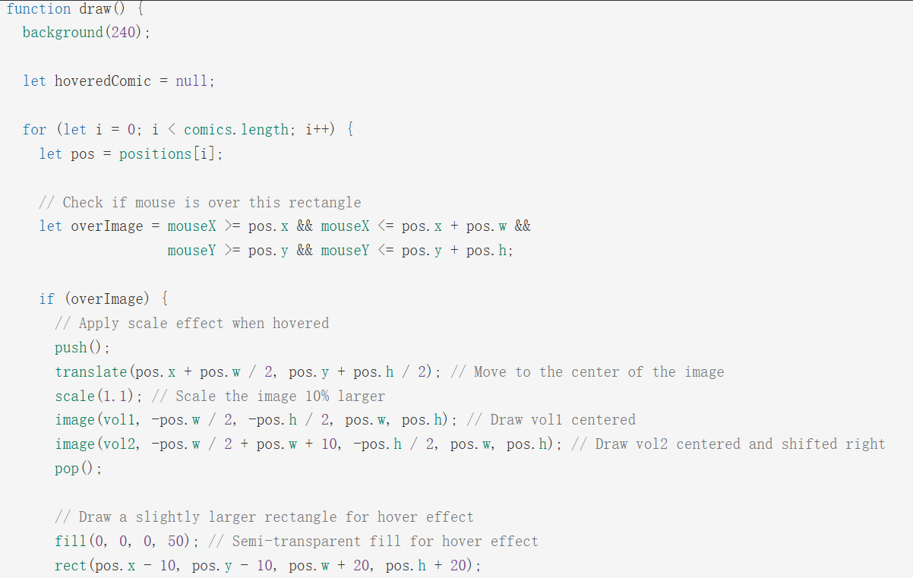

# Tut-5_Group-A_XinyaZhang-xzha0812

## 1. Interaction Instruction

- **Keyboard Interaction**  
  - **‘M’ or ‘m’ :** Style Switch   
    Switch between modern style or classic style 
  - **‘S’ or ‘s’ :** Symmetry Control   
    Switch between symmetrical and asymmetrical effects
  - **‘L’ or ‘l’ :** Line Weight  
    Cycle and switch the thickness of the lines (1x, 2x, 3x)  
  - **‘G’ or ‘g’ :** Triangle Generation Control  
    Stop/Start the dynamic generation of the triangle. Pressing it will maintain the current triangle state.  

- **Mouse Interaction**  
  - **Click Effects**  

    Different quadrants produce different visual effects:  
    - Click in Top-left Quadrant: Blue rotating lines  
    - Click in Top-right Quadrant: Red square diffused wave pattern
    - Click in Bottom-left Quadrant: Yellow triangle spreading
    - Click in Bottom-right Quadrant: Blue circular waves

  - **Hover Effects**  

    When the mouse hovers over different quadrants, different visual feedback will be generated:  
    - The top left and top right quadrants: rotation effect
    - The bottom left and bottom right quadrants: zoom effect

- **Notes**     
  - All interaction effects can be used together.
  - Style switching (by pressing the M key) will affect the overall visual effect.
  - Symmetry effect (by pressing the S key) will influence the display method of the entire screen.
  - Triangle generation control (by pressing the G key) only affects the triangular area in the lower left corner.

## 2. Individual Animation Approach

  In this project, I chose keyboard input and mouse interaction as the main driving methods for the animation. Users will trigger different visual feedback and dynamic effects by pressing specific keys or performing operations such as clicking and moving on the canvas.

### 2.1 Animated Properties

  In my animation design, the main animation attributes include rotation, scale, and transparency. These attributes dynamically change when the mouse hovers over them, creating a visual feedback effect of rotation and magnification. The canvas is divided into four quadrants, and when the user's mouse moves into any quadrant, the corresponding area responds according to the intensity of the hover, presenting an "activated" interactive experience.

  Besides, click operations also trigger quadrant-specific visual feedback. Clicking on different areas generates different styles of graphics and ripple animations, enriching the visual layers and interactivity. Moreover, the project integrates a keyboard input mechanism, allowing users to flip images, switch styles, adjust line thickness, and pause or resume animations through key presses, thus freely switching between static and dynamic states and enhancing the overall interactive control experience.

  Compared with other members of the group, my animation stands out in terms of interaction response mechanisms and visual presentation. One group member achieved physical animation effects such as collision and bouncing by controlling the position and movement path of the graphics; another focused on the periodic changes in the size and displacement of the graphics to create a strong rhythmic visual movement; and another member used music-driven techniques to combine the audio spectrum with dynamic images, enhancing the audio-visual synchronization experience. In contrast, I focused on dynamic perturbations in a static layout, achieving a visually tense hover and click feedback through subtle changes in rotation, scaling, and transparency. While ensuring the overall style is consistent, my part added a unique dynamic layer to the picture, further enriching the expression of the work.

### 2.2 Inspiration

  - **Inspiration 1: Ripple Effect**  

    I got important creative inspiration from Phoenix The Boi's work "Ripple Effect". This work adopts an interaction mechanism based on mouse clicks. When the user clicks on the canvas, a smooth outward-spreading ring is generated at the click position, as if it were the ripples caused by raindrops falling onto a still lake surface. As the radius of the ring continues to expand, its transparency gradually decreases and eventually dissipates naturally after reaching the set boundary. This visual presentation is simple and poetic, and highly attractive.

    Inspired by this mechanism, I decided to draw on its ripple diffusion and fading logic in this project and expand it into more diverse graphic elements and interaction methods. At the same time, it integrates the painting style of the project with various control parameters to enhance the overall interest and expressiveness.

       
       > Link to the "Ripple Effect" by Phoenix The Boi:
       [Ripple Effect](https://openprocessing.org/sketch/783165)

  - **Inspiration 2: Hover Effect**  

    The hover interaction design in this project is inspired by the work "Hover Interaction" by AlizayAlQuadr. This work demonstrates a technical approach that changes the image or graphic presentation by real-time detection of the mouse position. It also showcases a technical path for controlling the visual feedback of images and text through real-time tracking of the mouse position. When the user moves the mouse over a certain card, the card itself and the text below it will produce a slight magnification and bouncing effect, forming an outward-expanding dynamic feedback. This smooth, dynamic and feedback-oriented interaction method will greatly enhance the interactivity and layering of the page.

       
       > Link to the "Hover Interaction" by AlizayAlQuadr:
       [Hover Interaction](https://openprocessing.org/sketch/2604708)

## 3. Technical Explanation

### 3.1 Mouse Click - Ripple Effect

  - **Obtain the Click Quadrant**  

    The getQuadrant() function evenly divides the entire canvas into four quadrants based on the width and height ranges of the four images on the canvas. By detecting the (x, y) coordinate position of the current mouse, the function determines the area where it is located and returns the corresponding quadrant number (1 to 4). This number will be used later to classify different types of ripple effects, enabling the interactive response to trigger the corresponding animation based on the position where the user clicks.

       .png)

  - **Ripple Effect Classification**  

    When the user clicks on the canvas, mousePress() will obtain the position of the mouse click, call getQuadrant() to determine the corresponding quadrant area and number, and call the corresponding ripple creation function. The corresponding type will determine the subsequent animation effect.

       .png)

  - **Effect Classification and Parameter Defining**  

    The purpose of these functions is to set the style and important parameters of each ripple effect, including position, style type, initial size and maximum size, as well as transparency, and add them to the rippleEffects array.
    createBuildingEffect(x, y), createGeometricEffect(x, y), createTriangleRipple(x, y) and createCycleWave (x, y) define and initialise different styles of ripple effects. Each function creates a ripple object with the following key attributes based on the passed position parameters x and y, and stores it in the rippleEffects array:
      - **position:** The centre position of the corrugation (x, y).
      - **type:** Visual style types of ripples (such as building, geometric, triangle, circle).
      - **radius:** Initial radius
      - **maxRadius:** The maximum size of ripple diffusion, which determines its life cycle length.
      - **alpha:** Initial transparency, used for subsequent dynamic fade-out effects.

        .png)

  - **Drawing Ripple Effect**  

      - **drawRippleEffects()**

        The drawRippleEffects() drawRippleEffects() function uses a for...loop to traverse each ripple object in the rippleEffects array one by one. According to the type of each ripple object, draw the current corresponding graphic effect on the canvas respectively, including the blue rotating line, the red square diffused ripple, the yellow dynamic rotating triangle and the blue circular ripple. The style settings of each ripple are isolated through push()/pop(), and the ripple image of the current state is drawn based on the radius and alpha attributes of the object to achieve a real-time visual dynamic effect.

        .png)

      - **updateRippleEffects()**
        
        Then the updateRippleEffects() function will traverse the rippleEffects array from back to front through a for...loop to update the state of each ripple object. It simulates the outward diffusion of ripples by increasing the radius (radius), and decreasing the alpha (transparency) to gradually fade out the ripples. If the transparency of a ripple object drops to 0 or its radius exceeds its maxRadius, it is removed from the array through splice(i, 1), thereby ending the ripple's lifetime and maintaining the smoothness and performance of the animation.

        .png)

      - **Technology Inspiration**
        
        This part of the code refers to the key technical implementation methods adopted by Phoenix The Boi in the work "Ripple Effect". This technology simply and efficiently simulates the dynamic effect of ripple diffusion after clicking. In this project, I made appropriate adjustments and optimisations to this technology to better fit the image style and user interaction logic I set.
      
        Based on the original work, I made modifications to the drawing logic, parameter control and trigger mechanism, enabling the ripple effect to present different graphic effects according to different images, making it more in line with the painting style of the work and endowing the work with a richer and more interesting interactive experience.

        
        > Link to the code of "Ripple Effect" by Phoenix The Boi:
        [Ripple Effect](https://openprocessing.org/sketch/783165)

### 3.2 Mouse Click - Hover Effect  

  The hover effect technology used in this project is an updated and expanded version based on AlizayAlQuadr's work "Hover Interaction". This interaction method triggers visual transformations of the image simply by hovering the mouse over it. It is highly intuitive and responsive, greatly enhancing the fun and immersion of user participation.  

  Combined with the multi-quadrant and multi-element parallel layout structure adopted in this project, this hover-trigger mechanism can effectively guide users to focus on different areas of the canvas and perceive the unique response behaviour of each part, thereby improving the overall interaction experience and visual guidance effect.
  
  
  > Link to the code of "Hover Interaction" by AlizayAlQuadr:
  [Hover Interaction](https://openprocessing.org/sketch/2604708)

  - **mouseMoved()**  

    The mouseMoved() function detects the movement of the mouse on the canvas and updates the hover state of the image in real time. Inside the function, the getQuadrant(mouseX, mouseY) method defined beforehand is called to determine which quadrant (numbered 1 to 4) the current mouse position belongs to, and the result is stored in hoverEffects.quadrant for subsequent animation classification processing.  

    In addition, the hoverEffects.intensity parameter is used to control the intensity of the visual feedback, such as the rotation angle or scaling degree of the image. This value is limited between 0.1 and 1 to ensure that the animation changes are both responsive and visually stable.

    .png)

  - **draw()**  

    In the draw() function, four independent drawing logic segments correspond to the four quadrants of the canvas. Each quadrant triggers the corresponding rotation or zoom animation when the mouse hovers over it, thereby enhancing the overall interactivity and visual feedback. This logic uses if conditions to determine the current mouse quadrant, combines translate() and scale() to perform coordinate transformation and size adjustment of the drawing environment, and draws the image content based on the transformation to achieve a dynamic hover effect. To ensure that the drawing transformation does not affect other areas, this part introduces push() and pop() in the drawing logic of each quadrant to isolate the drawing state.

    _Hover_Effect.png)

### 3.3 Keyboard Interaction

  - **keyPressed()**  

    The keyPressed() function serves as the main entry point for keyboard interaction control in this project, responsible for mapping various user inputs to corresponding behaviour logic and animation state updates. Here are the specific functions of each key:

    - **M key (Style Switching)**   
      Used to switch between modern and classic style. After the switch, the visual attributes such as colour and line thickness of the image will change accordingly to showcase different artistic styles.
    - **G key (Left Bottom Triangle Animation Control)**    
      Controls the generation and pause of animations in the bottom left quadrant. After pressing G, the function uses the boolean variable isGeneratingTriangles to determine if it is currently in the generation state. If true, it calls updateTriangles() to continuously generate the triangle animation; if false, it uses drawSavedTriangles() to display the current saved triangle state, achieving pause and preserving the screen.
    - **S key (Up and Down Flip)**   
      Determine whether the current screen needs to be flipped based on the isSymmetric parameter. If flipping is enabled, it calls scale(1, -1) to achieve the mirror transformation of the entire canvas vertically, used to generate a symmetrical visual effect.
    - **L key (Line Thickness Cycling)**  
      Used to cycle through the thickness of all lines. The variable lineWeightMultiplier controls the line width multiplier, switching between 1x, 2x, and 3x, to enhance the visual hierarchy and expressiveness of the lines.

      .png)

  - **The Update Description of drawBottomLeft()**  

      To enable the triangle in the lower left area to respond to keyboard input and switch between animation generation and pause, the following key updates were made to the drawBottomLeft() function:

      - **generateGradientTriangles(border)**     

        The code originally located in the drawBottomLeft() function, which was used to randomly generate gradient equilateral triangles within a specified boundary area, was separated into an independent function, generateGradientTriangles(border). This function can automatically calculate the appropriate number of triangles and size range based on the boundary dimensions, and assign random positions and rotation angles to each triangle. Each triangle consists of three vertices, which are stored using createVector() and uniformly saved in the triangles[] array for subsequent drawing purposes.

        .png)

      - **drawSavedTriangles(triangles)** 

        The newly introduced drawSavedTriangles(triangles) function is used to statically draw the graphic content in the triangle array. This function iterates through the triangles array and calls drawGradientTriangle() to perform gradient colouring drawing for each triangle, which is used to present the current image state when the animation is paused.

        .png)

      - **Conditional logic in generateStructuredTriangles(rows, cols)**  
        To support the state management of animation and static switching, an if statement has been added in the generateStructuredTriangles(rows, cols) function. When isGeneratingTriangles is false, the function clears the relativeTriangles array and immediately returns, thereby stopping the generation process of triangles. This mechanism ensures that when the user presses the control key, they can immediately pause the graphic generation and retain the existing graphics on the canvas.

        .png)

 